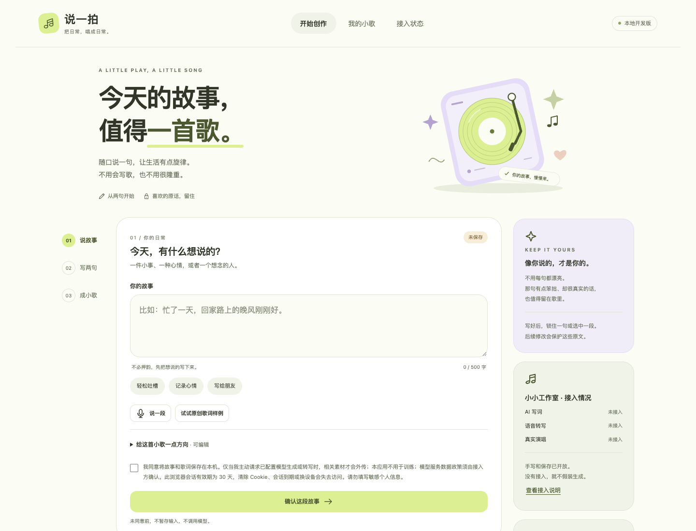
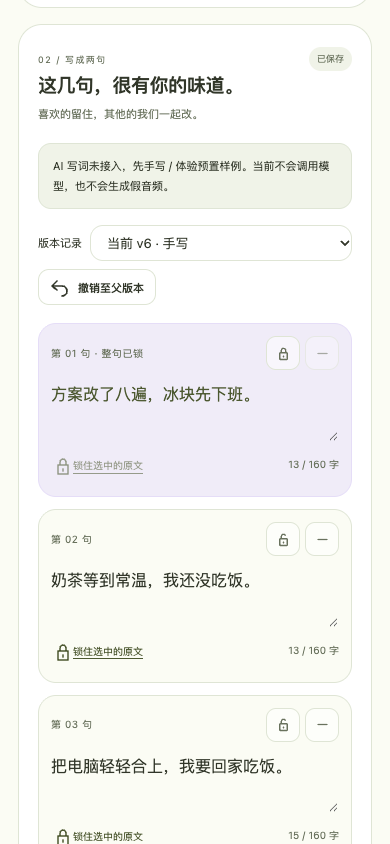
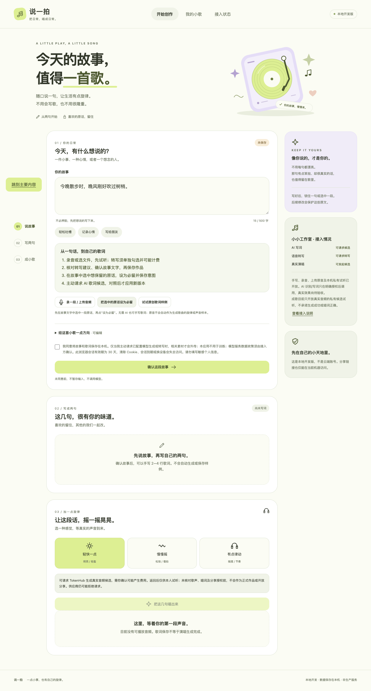

# 说一拍 SayBeat

把一句真实的话，变成一首属于自己的短歌。

「说一拍」是为腾讯音乐黑客松制作的创新音乐产品。用户可以从一段故事、一句原话或一段录音开始，手动或借助 AI 写成短歌词，再生成 15—30 秒的演唱候选。产品把“我的原话”“我的节奏”和“我的声音”放在同一条创作路径里，让 AI 参与创作，同时保留用户确认、修改和审核的权利。

线上体验：[saybeat-production.up.railway.app](https://saybeat-production.up.railway.app/)

## 产品亮点

- **原话进入歌曲**：用户可以锁定一句原话，后续歌词修改会保留这段文字。
- **说一拍**：连续拍击 4—16 下，把拍击间隔转换为 BPM 和节奏提示，带入歌曲生成。
- **三步简易版**：留一句话 → 确认歌词 → 听我的歌，降低第一次创作的理解成本。
- **完整工作室**：支持故事、歌词版本、锁句、修改请求、候选试听、审核、正式作品和分享管理。
- **原声开场**：作品完成后，可将用户录制的原声放在歌曲开头，形成“先听我说，再听我唱”。
- **声音日记**：每天留下一句话和一首短歌，逐渐形成个人记忆库。
- **谨慎的 AI 工作流**：AI 写词、语音转写和音乐生成均需要用户主动请求；候选音频先私有试听，审核通过后才能进入正式作品库。

## 当前 AI 能力

当前实现通过腾讯云 TokenHub 接入模型：

| 场景 | 模型或接口 | 说明 |
| --- | --- | --- |
| AI 写词 | `glm-5.3-flash` | 生成歌词候选，保留锁定原话并支持版本对照 |
| 语音转写 | `hy-asr-3.0-preview` | 将用户录音转为待确认文字 |
| 音乐生成 | `mureka-music-v9` | 生成私有演唱候选，目标时长 15—30 秒 |

产品不会在未接入真实服务时伪造歌词、转写或歌曲结果。也可以通过内部 AI Gateway 接入其他经过授权的供应商，详见 `.env.example` 和 `gateway-contract.json`。

## 界面预览







## 快速开始

### 环境要求

- Python 3.11 或更高版本
- macOS 本地音频审核需要系统工具 `afinfo`、`afconvert` 和 `clang`
- 浏览器建议使用最新版 Chrome、Edge 或 Safari

### macOS 一键启动

在 Finder 中双击 `run.command`。系统会打开一个终端窗口并启动服务，请保持窗口开启；然后访问：

```text
http://127.0.0.1:8765
```

如果 macOS 提示无法验证 `run.command`，可以在终端执行：

```bash
cd "/Users/y/Desktop/工作/黑客松/说一拍/shuoyipai"
chmod +x run.command
./run.command
```

也可以直接启动 Python 服务：

```bash
python3 server.py --host 127.0.0.1 --port 8765
```

本地默认只监听回环地址。设置 `PORT` 后，服务会按云平台方式监听公网地址；也可以显式传入 `--host 0.0.0.0`。

## 模型配置

复制环境变量示例并在当前终端或部署平台中配置真实值：

```ini
TENCENT_TOKENHUB_API_KEY=你的腾讯云TokenHub密钥
TOKENHUB_LYRICS_MODEL=glm-5.3-flash
SYP_DATA_DIR=./data
```

不要把真实密钥写入 GitHub、前端 JavaScript、截图、视频或 `.env.example`。本地如使用 `.env` 文件，权限应设置为 `600`：

```bash
chmod 600 .env
```

AI 请求可能产生供应商费用。产品会在发起写词、转写或音乐生成前要求相应的用户确认；真实模型的费用、数据保留和输出使用权仍以供应商规则为准。

### 可选的内部 Gateway

如果不使用 TokenHub，可以配置内部适配器：

```ini
AI_GATEWAY_URL=https://your-internal-gateway.example.com
AI_GATEWAY_KEY=只在服务端保存的适配器密钥
AI_GATEWAY_FEATURES=lyrics,speech,singing
AI_RIGHTS_CONFIRMED=true
```

`AI_GATEWAY_URL` 必须使用 HTTPS；仅本机测试允许使用 HTTP 回环地址。Gateway 需要遵循 `gateway-contract.json` 中的请求和返回结构。

## Railway 部署

项目已经支持 Railway。将 GitHub 仓库连接到 Railway 服务后，建议使用以下配置。

### Start Command

```bash
python3 server.py --host 0.0.0.0 --port $PORT --data-dir /app/data
```

### 服务变量

```ini
TENCENT_TOKENHUB_API_KEY=你的新密钥
TOKENHUB_LYRICS_MODEL=glm-5.3-flash
SYP_DATA_DIR=/app/data
```

可选地显式允许 Railway 域名：

```ini
SYP_ALLOWED_HOSTS=saybeat-production.up.railway.app
```

### 持久化存储

为服务添加 Railway Volume，并将挂载路径设置为：

```text
/app/data
```

该目录保存 SQLite 数据库、上传的原音、候选音频和正式作品。没有 Volume 时，重新部署可能会丢失服务实例中的数据。

### 公网域名

为服务生成 Railway 公网域名，并将目标端口设置为 `8080`（或平台实际分配的端口）。部署完成后访问：

```text
https://你的域名/
```

Railway 连接 GitHub 的 `main` 分支后，新的提交会自动触发部署。密钥只放在 Railway Variables 中，不要提交到仓库。

## 创作流程

### 简易版

1. 输入或录制一句原话。
2. 选择 AI 写词或手动写两句。
3. 核对并确认歌词。
4. 确认费用和使用权后请求生成歌曲。
5. 返回候选后先试听，再进入完整审核。

### 完整工作室

完整流程还包括：

- 故事保存和版本号管理
- 原话选中、锁定和解锁
- 歌词候选对照、修改请求和历史版本
- WAV、MP3、M4A/MP4 音频上传与本机试听
- 可选语音转写，转写结果必须人工确认后才会写入故事
- 节奏拍击、试听和保存 BPM
- 候选音频的唱词、音质、格式、时长和使用权审核
- 候选转正式作品、保留、导出和撤回分享
- 原声开场合成
- 声音日记、作品库和内部诊断数据

## 音频审核规则

生成结果不会因为“接口返回成功”就自动成为正式作品。候选需要经过以下检查：

- 音频能够完整解码并保存为有效的 WAV 或 MP3
- 有实际声音，不能是空文件或静音文件
- 正式短歌目标时长为 15—30 秒
- 供应商返回明确的演唱和歌词一致性校验
- 使用权、展示范围、分享范围和导出范围已经确认

过长或过短的候选可以尝试轻微调速；偏差过大时会要求重新生成，避免用过度变速破坏作品。

## 测试与评测

运行自动化测试：

```bash
python3 -m unittest discover -s tests -p 'test_*.py'
```

运行冻结难例评测：

```bash
python3 scripts/evaluate_hard_cases.py evaluation/baseline-v1-results.json
```

浏览器验收脚本位于 `scripts/`，包括快速浏览器验收、创作流程、声音日记、诊断和质量基线脚本。真实语音、真人录音、模型唱词准确度和供应商返回音频仍需要在真实环境中单独验收，不能用自动替身结果代替。

## 数据与隐私

- 默认数据目录为项目下的 `data/`，部署时建议使用 Railway Volume。
- SQLite、音频和分享数据属于服务端私有数据，应限制文件权限并定期备份。
- 未同意前，故事和录音不会保存，也不会调用模型。
- 录音上传后会先在浏览器中试听；自动转写需要单独同意。
- 生成候选默认只供本人试听，未经审核不会自动公开、分享或导出。
- 当前版本没有完整的多用户账号系统；会话依赖浏览器 Cookie，适合黑客松演示和小范围体验。
- 供应商的数据保留、训练政策和费用不由本项目单方面决定，接入前应由部署方确认。

## 项目结构

```text
server.py                 HTTP 服务、会话、创作流程和任务队列
backend/domain.py         作品、歌词版本、锁句和数据库领域逻辑
backend/providers.py      TokenHub 与内部 Gateway 适配器
backend/audio_review.py   音频解码、格式、静音和时长审核
backend/composition.py    原声开场合成
backend/diary.py          声音日记与月度歌曲数据逻辑
backend/analytics.py      漏斗埋点与诊断数据
web/                      前端页面、样式、节奏和录音交互
tests/                    单元测试与 HTTP 流程测试
evaluation/               冻结难例、质量基线和 P0 验收记录
scripts/                  浏览器验收、数据种子和评测脚本
run.command               macOS 本地启动脚本
```

## 当前边界

「说一拍」目前是以黑客松演示和小范围体验为目标的产品原型。它已经具备完整的创作、候选审核和部署链路，但还不适合作为开放注册的大规模生产服务。若要正式面向公众开放，建议继续补充账号与权限体系、后台任务监控、成本限额、对象存储、内容审核、供应商故障重试和隐私政策。

## License

当前仓库未声明开源许可证。除非项目所有者另行授权，请不要将代码、模型接入配置或生成内容用于商业分发。
